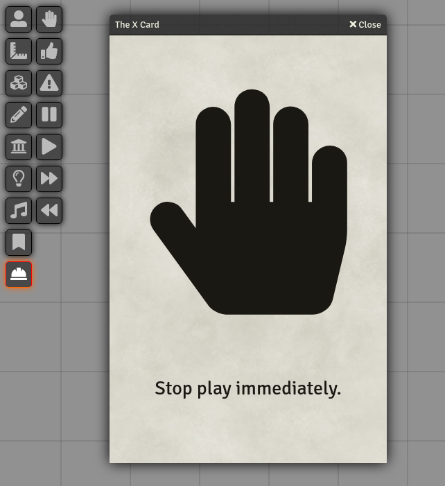
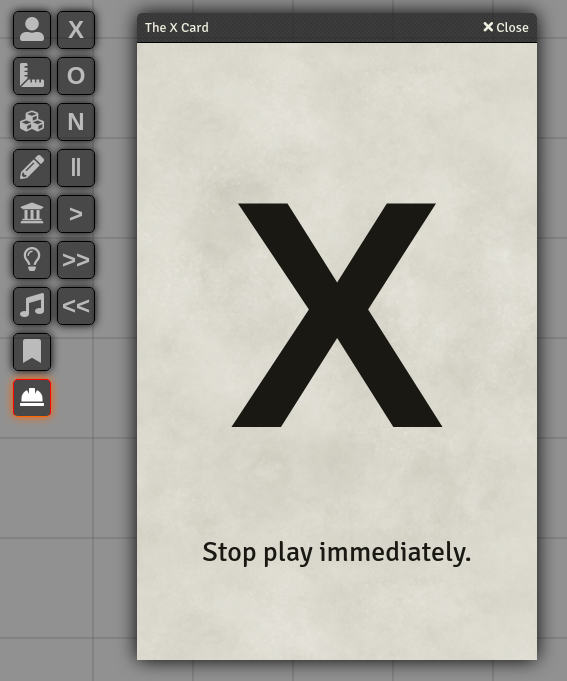

# Safety Tools

This module aims to provide Foundry with the full set of safety tools described in [TTRPG Safety Toolkit](ttrpg-safety-toolkit).

## Features

* You can toggle whether each safety card should be visible
* You can toggle between icons and text
  

## Future development

* Add more customisation
* Add more translations

[ttrpg-safety-toolkit]: https://thetrove.is/Resources/TTRPG%20Safety%20Toolkit/TTRPG%20Safety%20Toolkit%20Guide.pdf
